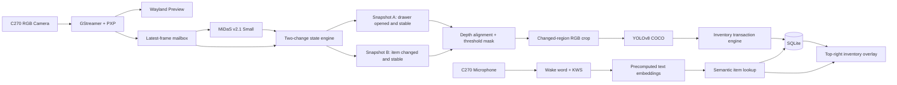

# i.MX93 智慧抽屜 — DesignDoc

> 版本：MVP v0.2（意圖確認版）  
> 目標平台：FRDM-i.MX93 + Logitech C270（RGB Camera + microphone）+ HDMI display + USB mouse  
> Runtime 原則：相機、深度估計、物件辨識、語音查詢、SQLite 與 UI 全部在 i.MX93；PC 只允許模型準備、量化、Vela 編譯與部署  
> 文件語言：繁體中文；程式名稱、enum、JSON 與 database 欄位使用英文

## 0. 已鎖定決策

| 項目 | MVP 決策 |
|---|---|
| Camera | Logitech C270，固定俯角；MVP 假設 Camera 不會移動 |
| 反光 | 不設計、不限制、不測試任何抽屜或物品反光處理 |
| 深度模型 | MiDaS v2.1 Small；只使用相對深度，不宣稱實際公分距離 |
| 支援層數 | 1–6 層，最上層固定為 `layer_no=1` |
| 初始化前提 | 所有抽屜必須清空並關閉，再由上到下逐層拉出、記錄、關回；一次只開一層 |
| 層數來源 | 成功記錄的逐層校正次數；最後以滑鼠按 `Finish initialization` |
| 永久層級基準 | 保存每層空抽屜底部「最深區域」的 robust depth statistic，不使用單一 pixel |
| 抽屜開度 | 允許任意開度；MVP 不補償開度對永久 depth baseline 的影響，此為已接受限制 |
| 第一次深度變化 | 抽屜拉出後，在 drawer ROI 連續 3 張穩定 depth 取 median，保存 Snapshot A 並判層 |
| 第二次深度變化 | 放入／取出後再次等待 drawer ROI 穩定，保存 Snapshot B |
| 物品辨識 | 只 crop `abs(depth_B-depth_A)` 超過 threshold 的區域；禁止掃描整層抽屜 |
| Put / take | 只靠 aligned signed depth change 判斷；put 對 RGB_B crop 跑一次 YOLO，take 對 RGB_A crop 跑一次 |
| 第三次變化 | Snapshot B 建立後到抽屜關閉前的後續變化全部忽略，接受實物與 DB 可能不同步的風險 |
| 提交時機 | 第二次變化結果先暫存；抽屜關閉後才 commit SQLite |
| 物品模型 | Pretrained YOLOv8 COCO 80-class INT8 TFLite；設定檔只啟用 20 個可放入抽屜的類別 |
| Inventory | SQLite quantity；初始化為空，只由成功提交的 `put/take` 更新 |
| Untracked take | 記錄 `applied=false` event，但 inventory 不減少 |
| 錯誤修正 | MVP 不提供 Undo 或人工修改 |
| 同義詞 | 固定 KWS token 使用預先計算 multilingual text embeddings，以 cosine similarity 對應 enabled YOLO class |
| 語音 | C270 microphone；`Hey 抽屜` + bounded KWS；drawer transaction 期間停用 |
| 回覆 | HDMI 右上角常駐完整 inventory；超出高度時以滑鼠捲動；MVP 不做 TTS |
| 控制 | 只能使用滑鼠點擊 UI，不提供鍵盤、觸控或控制語音 |
| 重啟 | 啟動畫面以滑鼠選擇沿用永久 calibration/inventory，或清空後重新初始化 |
| PC runtime | 完全禁止；任一必要模型無法在 i.MX93 達標即 Gate 失敗 |
| Future scaling | 多台設備加入 `device_id`，同步 metadata 與 embeddings 至中央服務 |

### 0.1 實機校正參數

下列數值不是產品意圖，不在 Design 階段假裝已知；Gate 0 以實機資料決定後寫入 `model_manifest.json`，正式 demo 不開放臨時修改：

- depth noise/start/stability thresholds
- layer match tolerance
- object-change threshold
- minimum change area / component merge gap
- put/take direction threshold
- crop padding（初值 25%）
- YOLO confidence / NMS IoU / changed-mask overlap
- semantic minimum score / top-1 margin
- wake-word/KWS confidence 與 command-window duration

## 1. 問題與目標

系統要完成四件事：

1. 使用 C270 與 MiDaS，在逐層初始化後知道抽屜共有幾層。
2. Runtime 期間辨識目前拉出的是第幾層。
3. 辨識該次放入或取出的 YOLOv8 COCO 物品，原子更新本機庫存。
4. 使用者說出固定語音查詢後，透過語意 embedding 找到 canonical item，顯示它位於哪一層。

### 1.1 完整流程

```text
Boot
  → Gate 0 檢查 camera / microphone / models / NPU / database / display
  → 滑鼠選擇 Resume 或 Clear and initialize
  → Resume：要求所有抽屜關閉，載入永久 calibration/inventory，驗證 baseline 後 Ready
  → Initialize：要求 1–6 層抽屜全部清空並關閉
  → 擷取 closed/background depth baseline
  → 由上到下逐層：拉出 → ROI 連續 3 張穩定 → 記錄空抽屜底部最深 depth baseline → 關回
  → 滑鼠按 Finish initialization
  → inventory 初始化為空；不執行 YOLO、不掃描層內物品
  → Ready

Ready
  → 第一次 depth motion：偵測抽屜拉出
  → drawer ROI 連續 3 張穩定，depth 取 median、RGB 取中間 frame，建立 Snapshot A
  → 以 Snapshot A 的最深底部 depth 對比永久 baselines，決定 layer
  → 使用者只放入或取出一件物品
  → 第二次 depth motion 後再次連續 3 張穩定，建立 Snapshot B
  → 對齊 depth_A/depth_B，取誤差大於 object-change threshold 的唯一區域
  → signed depth 變近：put，對 RGB_B crop 執行一次 YOLO
  → signed depth 變遠：take，對 RGB_A crop 執行一次 YOLO
  → 暫存 candidate；忽略之後的第三次或更多變化
  → 抽屜關閉後，以 SQLite transaction 更新 inventory/event
  → 回到 Ready 並恢復語音查詢

Voice query
  → 偵測 "Hey 抽屜"
  → 3 秒 command window 內辨識一個固定物品詞
  → embedding nearest-neighbor 映射至 YOLO canonical class
  → 查詢 SQLite
  → 右上角顯示「電腦（laptop）：第 2 層」
```

### 1.2 非目標

- 不從 C270 推算真實公分距離。
- 不允許同時打開兩層抽屜。
- 不支援一次增減多件物品。
- 不在初始化或抽屜開啟時掃描整層物品；只辨識兩次穩定深度圖之間的變化 crop。
- 初始化時所有抽屜必須為空；未經成功 `put` 的物品不會出現在 inventory。
- 不支援設定檔所選 20 類以外的物品；一般眼鏡不在 COCO detector 類別內。
- 不辨識同類物品的個體身份，只維護 class 與 quantity。
- 不處理嚴重重疊、完全遮擋、透明物品或極小物品。
- 不提供 Undo、人工修改、第三次變化修正或反光處理。
- 不保證任意開度造成底部 depth 改變時仍能正確判層。
- 不做自由中文 ASR、對話式 LLM、TTS 或 Cloud API。
- 不在 runtime 將影像或音訊送到 PC。
- 不在 MVP 使用中央 vector database。

## 2. 來自 `Ref/` 的設計依據

| 參考                                                | 採用內容                                                                                                                           |
| --------------------------------------------------- | ---------------------------------------------------------------------------------------------------------------------------------- |
| `Ref/FRDM-IMX93_Meichu_Hackathon_Detailed_Notes.md` | i.MX93 Cortex-A55、Ethos-U65、2 GB RAM、Vela、external delegate、MiDaS v2.1 Small 與 YOLOv8 model-zoo 資訊、CPU/NPU benchmark 流程 |
| `Ref/nxp-demo-experience-demos-list/.../detection/` | USB camera、GStreamer/NNStreamer、PXP preprocessing、Ethos-U delegate 與 display pipeline 模式                                     |
| `Ref/eiq-example/object_detection/`                 | TFLite object detection、COCO label 與 camera inference 基本流程                                                                   |
| `Ref/smart-kitchen/`                                | i.MX93 本機 voice command + GUI 的系統分工；VIT/AFE 能力參考                                                                       |
| `Ref/Edge AI Example/`                              | MQTT edge-event 架構只保留給 Future scaling；MVP 不依賴 PC/MQTT                                                                    |
| `Presentation/DESIGN.md`                            | 單一 camera owner、latest-frame mailbox、delegate 證據、hardware gate 與 unknown-safe 行為                                         |

重要限制：目前 `Ref/` 沒有附 MiDaS v2.1 Small、YOLOv8 或中文 KWS 的可直接部署 `.tflite` 檔。因此模型取得、量化、Vela 相容性與 benchmark 是實作前 Gate，不可只因文件列出模型名稱就宣稱已在 NPU 執行。

## 3. 場地與硬體契約

### 3.1 Camera 安裝

- C270 固定於抽屜前上方，以俯角同時看見所有抽屜面板與完全拉出的抽屜內部。
- Camera、櫃體與地面初始化後不可移動。
- 畫面不可水平鏡像；最上層永遠是 `layer_no=1`。
- 支援 1–6 層；每層拉出後，抽屜底部與物品操作區都必須位於畫面內。
- 每次只允許一層打開；初始化時所有抽屜必須為空。
- 照明保持固定；反光不納入設計或驗收。
- 允許任意開度，但不補償開度造成的 depth baseline 漂移。
- 一次只操作一件物品，物品需完整可見且不可堆疊。
- 手必須離開 drawer ROI；系統只以 ROI depth stability 判斷，不加入 hand detector。
- Snapshot B 確認後到關閉前不得再操作；若仍操作，系統依已確認意圖忽略該變化。

### 3.2 Video / audio

- Camera capture 優先使用 C270 已驗證的 `1280x720 YUY2` mode。
- Analysis branch 使用 `640x480`；模型再依各自 input shape resize/letterbox。
- Preview 目標為 20 FPS 以上；AI inference 不得阻塞 preview。
- Microphone 必須由 C270 枚舉為 ALSA capture device。
- Audio 固定轉為 mono, 16 kHz, signed 16-bit PCM 後交給 KWS。

### 3.3 Single owner

只有 `smart_drawer/app.py` 可以開啟 C270 video 與 microphone。GoPoint camera/voice demo 不得與正式程式同時執行。

## 4. 系統架構



### 4.1 Runtime process

MVP 使用單一 Linux process：

- GStreamer callback：只更新 latest frame。
- Vision worker：序列化呼叫 MiDaS 與 YOLO interpreters。
- Audio worker：處理 wake word/KWS；不得存錄音。
- UI/main loop：state machine、overlay 與 user controls。
- SQLite connection：只由 main/state thread 寫入。

不建立 microservice、MQTT broker、REST API 或 plugin framework。

### 4.2 NPU scheduling

Ethos-U 同一時間只執行一個 vision inference：

1. MiDaS 以 2–3 Hz 持續提供 drawer motion、stability 與 Snapshot A/B。
2. YOLO 不掃描每個 frame，也不掃描整層；只在第二次深度變化穩定後，對唯一 changed-region crop 執行一次。
3. YOLO 執行期間暫停 MiDaS；完成後恢復 depth loop。
4. KWS 優先使用 CPU/M33 可用路徑，避免長時間占用 Ethos-U；實際 backend 由 Gate 0 benchmark 鎖定。

若模型有 unsupported ops，允許由 Cortex-A55 做 postprocessing/fallback，但 UI 必須顯示實際 backend，不得把部分 delegation 宣稱為全 NPU。

## 5. State machine

```text
booting
  → startup_choice
  → resume_validation → ready
  → needs_initialization
  → initializing_wait_open
  → initializing_open_stable
  → initializing_wait_close
  → ready
  → first_change_motion
  → snapshot_a_stable
  → wait_item_change
  → second_change_motion
  → snapshot_b_stable
  → detecting_changed_crop
  → candidate_confirmed
  → wait_drawer_close
  → committing
  → ready

fatal dependency failure → error
recoverable rejection → wait_drawer_close → ready
```

### 5.1 合法行為

| State | 行為 |
|---|---|
| `startup_choice` | 滑鼠選擇沿用永久資料，或清空後重新初始化 |
| `resume_validation` | 所有抽屜關閉時驗證 camera/closed baseline；成功才 Ready |
| `needs_initialization` | 1–6 層抽屜全部清空並關閉後，以滑鼠按 Initialize |
| `initializing_wait_open` | 只接受下一層由上到下拉出 |
| `initializing_open_stable` | 連續 3 張 ROI depth 穩定後保存最深底部 baseline 與 mask；不跑 YOLO |
| `initializing_wait_close` | 必須先關回目前層，才能記錄下一層 |
| `ready` | 接受第一次 depth motion 或 voice query |
| `first_change_motion` | 抽屜正在拉出；停用 voice query，等待 ROI 穩定 |
| `snapshot_a_stable` | 保存 `RGB_A + depth_A`，以最深底部 depth 配對 layer |
| `wait_item_change` | 等待一次放入／取出造成第二次 depth motion |
| `second_change_motion` | 物品或手正在移動，等待 ROI 再次穩定 |
| `snapshot_b_stable` | 保存 `RGB_B + depth_B`，建立唯一 changed mask/crop |
| `detecting_changed_crop` | signed depth 決定 action，只對 A 或 B 的 crop 跑一次 YOLO |
| `candidate_confirmed` | 暫存 layer/action/class/confidence；之後的第三次變化全部忽略 |
| `wait_drawer_close` | 等待同一層回到 closed baseline，不修改 candidate |
| `committing` | 關閉後原子更新 inventory/event；完成後恢復 voice query |
| `error` | 只用於 camera/model/database 等 fatal error |

## 6. MiDaS 相對深度、穩定判斷與層級基準

### 6.1 Depth normalization/alignment

C270 是單眼 RGB camera，MiDaS 輸出只有相對尺度。每張 depth 先做 robust normalization；跨 snapshot 比較時，再使用不屬於 drawer ROI 的固定 cabinet background pixels 估計 affine `a,b`：

```text
z_norm = clip((z - percentile(z, 5)) /
              (percentile(z, 95) - percentile(z, 5) + eps), 0, 1)
z_aligned = a * z_norm + b
```

禁止轉換成公分。Model manifest 必須記錄 MiDaS 輸出「較近／較遠」的正負方向。

### 6.2 Closed/background baseline

初始化前所有 1–6 層抽屜必須清空並關閉：

1. 連續取得 15 張有效 depth。
2. 每 pixel 取 median，保存 `closed_depth_baseline`。
3. 自動選取抽屜區域外的固定 cabinet background mask，供跨 frame alignment。
4. 由 closed sequence 估計 depth noise distribution。

若 Camera、櫃體或光線在初始化後改變，MVP 不自動補償。

### 6.3 ROI 自適應 motion/stability

第一個 motion 尚未判層時，先以 cabinet 中所有 drawer candidate ROI 的聯集偵測；判層後只使用目前 drawer ROI：

```text
abs_diff = abs(depth_t_aligned - depth_previous)
changed_ratio = count(abs_diff > noise_threshold) / roi_pixel_count
motion_score = percentile(abs_diff within ROI, 95)
```

- `changed_ratio` 或 `motion_score` 超過由 baseline noise 推導的 start threshold：進入 motion。
- 之後兩者皆低於 stability threshold，且連續 3 個有效 depth frames：判定穩定。
- 穩定 depth snapshot 是 3 張 aligned depth 的 pixel-wise median。
- RGB snapshot 使用上述 3 張中間時間點、且產生該 depth 的同一張 RGB frame。
- 所有 thresholds 是 `model_manifest.json` 的 calibration knobs；文件中的初值不是最終保證值。

### 6.4 逐層初始化

對第 `i` 層：

1. UI 要求從最上層開始拉出下一個空抽屜。
2. 第一次 motion 結束且連續 3 張 depth 穩定後，取得 empty-drawer depth snapshot。
3. 從可見抽屜底部取最遠端有效 pixels 的 percentile band，再以該 band median 得到 `bottom_depth_baseline_i`；禁止使用單一最值 pixel。
4. 永久保存 `layer_no`、`bottom_depth_baseline_i`、drawer/interior mask、open/close thresholds。
5. 不執行 YOLO，不建立 inventory。
6. 抽屜回到 closed baseline 後記錄下一層。

使用者以滑鼠按 `Finish initialization`；成功循環數即 drawer count，最多 6。系統不以 timeout 猜測最後一層。

### 6.5 Runtime 判層

第一次 motion 結束並穩定後建立 Snapshot A：

1. 以 background mask 將 `depth_A` 對齊永久 calibration coordinate。
2. 使用與初始化相同的 farthest-percentile-band 方法取得 `bottom_depth_A`。
3. 計算與每層永久 baseline 的距離。
4. 唯一最近且通過 `layer_match_tolerance` 才接受該 layer；平手或超出 tolerance 為 `drawer_unknown`。
5. Snapshot A 同時保存對應 `RGB_A`，供 take crop 使用。

使用者已決定允許任意開度，但不處理開度造成的 bottom-depth variation；因此這是 MVP 已知限制，不建立多開度 prototypes，也不加入 y-position fallback。

### 6.6 關閉辨識

- 目前 layer 的 depth 回到 `closed_depth_baseline` 且連續 3 張穩定，才視為關閉。
- 若 Snapshot B 尚未建立就關閉，丟棄 transaction。
- Candidate 已建立後，關閉前的第三次或更多 depth motion 全部忽略，不重建 Snapshot B。

## 7. 兩次深度變化、Changed Crop 與 YOLOv8

### 7.1 Model contract

- Variant：可部署至 i.MX93 的 YOLOv8 nano-class COCO model。
- Input：INT8 TFLite；實際 shape 由 model metadata 讀取。
- Runtime：`tflite_runtime`；i.MX93 優先載入 `/usr/lib/libethosu_delegate.so`。
- NPU model 必須先經 Vela；YOLO decode 與 NMS 可在 A55 執行。
- Labels 必須直接由同版 model artifact 取得，禁止手寫另一份不同順序的 80-class list。
- 預設 detection confidence `0.50`、NMS IoU `0.45`；兩者是實機 calibration knobs。

### 7.2 Snapshot contract

同一 transaction 在 RAM 只保留兩組穩定 snapshot；每組 depth 為連續 3 張的 median，RGB 為中間對應 frame：

```text
Snapshot A = RGB_A + depth_A
  時機：抽屜拉出造成第一次 motion，之後 ROI 穩定
  用途：判層；若 action=take，從 RGB_A changed crop 辨識物品

Snapshot B = RGB_B + depth_B
  時機：物品操作造成第二次 motion，之後 ROI 穩定
  用途：與 depth_A 比較；若 action=put，從 RGB_B changed crop 辨識物品
```

禁止將完整 RGB_A/RGB_B 或完整 drawer ROI 送入 YOLO。

### 7.3 Depth alignment 與 changed mask

以初始化保存的 background mask 對齊 A/B：

```text
depth_B_aligned = a * depth_B + b
delta = depth_B_aligned - depth_A
changed_mask = abs(delta) > object_change_threshold
```

規則：

1. `object_change_threshold` 由 Snapshot A 穩定序列的 ROI noise percentile 推導。
2. `changed_mask` 必須與目前 drawer interior mask 取交集。
3. 以 morphology open/close 去除 speckle，刪除小於 `min_change_area` 的 component。
4. 距離小於 `component_merge_gap` 的 components 視為同一物品並合併。
5. 合併後若仍有兩個分離且達面積門檻的區域，回 `multiple_items`，不執行 YOLO。
6. 唯一區域的 bounding box 擴張 25%，轉為 square，最後 clamp 至 analysis frame；padding 是實機 calibration knob。

### 7.4 只以 signed depth 判斷 Put / take

Model manifest 記錄 MiDaS 輸出方向。對唯一 changed mask `M`：

```text
signed_change = median(delta within M)
```

- 代表新增較近表面：`action=put`，只對 `RGB_B` crop 跑一次 YOLO。
- 代表原表面消失、露出較遠底部：`action=take`，只對 `RGB_A` crop 跑一次 YOLO。
- `abs(signed_change) < direction_threshold`：`unknown_action`，不執行 YOLO、不寫 DB。

此 MVP 不以 A/B 雙 YOLO 驗證 direction。透明、非常薄或與抽屜底 depth 差太小的物品可能無法通過 direction gate。

### 7.5 Changed-crop YOLO

- Crop 以 aspect-ratio-preserving letterbox 轉成 model input。
- 只保留 `enabled_classes.json` 的 20 類。
- Detection confidence、NMS IoU 與 changed-mask overlap threshold 都是 Gate 0 後凍結的 calibration knobs。
- 合法結果只能有一個 enabled class；零個為 `unsupported_or_occluded`，多個為 `multiple_items`。
- 每個 transaction 最多一次 YOLO inference；不建立整層 detection set 或 class-count diff。

### 7.6 Candidate 與關閉後提交

- YOLO 成功後只建立 RAM candidate：`layer/action/class/confidence/signed_depth_change`。
- Candidate 建立後，第三次或更多 depth change 全部忽略，不重建 candidate。
- 同一抽屜回到 closed baseline 後才開始 SQLite transaction。
- `put`：quantity 加 1；`take`：quantity 大於 0 時減 1。
- Untracked take 寫入 `applied=false, reason=untracked_take` event，inventory 維持 0。
- Commit 成功才顯示最終結果；失敗則 rollback。
- MVP 不提供 Undo 或人工修改。
- Snapshot A/B、crop 與 candidate 在 commit、rollback、直接關閉或 process restart 後從 RAM 丟棄。

## 8. 語音與語意 mapping

### 8.1 Audio flow

```text
C270 ALSA capture
  → 16 kHz mono PCM
  → wake-word detector: "Hey 抽屜"
  → 3 秒 command window
  → bounded KWS：辨識 enabled 20-class 的物品詞／別名 token
  → precomputed embedding mapping
  → SQLite query
```

- 只在 `ready` state 啟用；drawer transaction 與 initialization 期間停用。
- 3 秒內無有效 token 或 KWS 輸出 `unknown`，顯示 `沒有聽清楚`。
- 同一 wake word 只觸發一次 command window。
- 不保存 PCM，不把音訊送出裝置。

### 8.2 Enabled 20-class vocabulary

- YOLO artifact 仍含 COCO 80 labels，但 `enabled_classes.json` 必須恰好選 20 個可放入抽屜的 canonical labels。
- KWS vocabulary 只包含這 20 類及其部署前固定的中文／英文別名。
- 預設建議清單可由設定檔替換：`bottle, wine glass, cup, fork, knife, spoon, bowl, banana, apple, orange, sandwich, laptop, mouse, remote, keyboard, cell phone, book, clock, scissors, toothbrush`。
- 例：`電腦`、`筆電`、`notebook` 的 token embeddings 均應最近於 `laptop`。
- 未在固定 KWS vocabulary 的說法只會得到 `unknown`，不宣稱能理解任意同義詞。

### 8.3 Embedding mapping

為維持全 Edge 且避免 runtime 執行大型 text encoder：

1. PC deployment 階段使用固定版 multilingual text encoder，為 canonical labels 與所有 KWS tokens 產生 normalized embeddings。
2. 將向量與 model/version metadata 輸出為 `semantic_catalog.npz`。
3. i.MX93 runtime 只載入向量，對 KWS token 的預先計算向量做 cosine nearest-neighbor。
4. 最高 similarity 必須通過 `semantic_min_score`，且與第二名差距通過 `semantic_min_margin`。
5. 失敗時顯示候選，不查 DB。

由於詞表固定，runtime 不需要 CLIP 或 LLM；embedding 只解決語意同義詞到 canonical YOLO label 的映射。

### 8.4 Query result

```text
SELECT drawer_id, quantity
FROM inventory
WHERE class_id = ? AND quantity > 0
ORDER BY drawer_id;
```

UI 行為：

- 一個位置：`電腦（laptop）：第 2 層，1 件`。
- 多個位置：`laptop：第 2 層 1 件、第 4 層 1 件`。
- 無資料：`找不到 laptop`。
- `unknown/unsupported` 與 `not found` 必須分開顯示。

## 9. SQLite schema

Database：`data/smart_drawer.db`

```sql
CREATE TABLE metadata (
    key TEXT PRIMARY KEY,
    value TEXT NOT NULL
);

CREATE TABLE drawer (
    drawer_id INTEGER PRIMARY KEY,
    layer_no INTEGER NOT NULL UNIQUE CHECK(layer_no BETWEEN 1 AND 6),
    bottom_depth_baseline REAL NOT NULL,
    drawer_mask_blob BLOB NOT NULL,
    interior_mask_blob BLOB NOT NULL,
    open_threshold REAL NOT NULL,
    close_threshold REAL NOT NULL,
    calibrated_at TEXT NOT NULL
);

CREATE TABLE item_catalog (
    class_id INTEGER PRIMARY KEY,
    canonical_label TEXT NOT NULL UNIQUE,
    enabled INTEGER NOT NULL CHECK(enabled IN (0, 1))
);

CREATE TABLE inventory (
    drawer_id INTEGER NOT NULL REFERENCES drawer(drawer_id),
    class_id INTEGER NOT NULL REFERENCES item_catalog(class_id),
    quantity INTEGER NOT NULL CHECK(quantity >= 0),
    detector_confidence REAL NOT NULL,
    updated_at TEXT NOT NULL,
    PRIMARY KEY(drawer_id, class_id)
);

CREATE TABLE event (
    event_id TEXT PRIMARY KEY,
    occurred_at TEXT NOT NULL,
    layer_no INTEGER NOT NULL CHECK(layer_no BETWEEN 1 AND 6),
    action TEXT NOT NULL CHECK(action IN ('put','take')),
    class_id INTEGER NOT NULL REFERENCES item_catalog(class_id),
    delta INTEGER NOT NULL,
    applied INTEGER NOT NULL CHECK(applied IN (0, 1)),
    detector_confidence REAL NOT NULL,
    signed_depth_change REAL NOT NULL,
    reason TEXT,
    CHECK((action = 'put' AND delta = 1) OR
          (action = 'take' AND delta = -1))
);
```

Database rules：

- 啟用 foreign keys。
- 成功的 put/take 以同一 transaction 更新 `inventory` 與 `event`。
- `untracked_take` 只新增 `applied=0` event，不修改 inventory。
- 初始化完成時 inventory 為空；沒有 `initial_scan/resync/undo` action。
- 啟動選擇 Resume 時只讀取已提交資料；上次未提交 candidate 永遠不存在於 DB。
- Event 直接保存 `layer_no` 而不 foreign-key 至 calibration row，因此 Clear 後仍可保留 audit history。
- 啟動選擇 Clear and initialize 時，滑鼠二次確認後清除 inventory/drawer；event history 保留作 audit。
- database schema/model/catalog/checksum versions 放在 `metadata`。
- Snapshot A/B、changed mask、crop、candidate 與 audio 只存在 RAM；永久 calibration 只保存 baseline scalar 與低解析度 masks。

## 10. UI 規格

### 10.1 Preview 與 inventory panel

- 全螢幕 camera preview。
- 左上角：system state、Depth FPS、YOLO backend、KWS state。
- 中央下方：目前操作提示。
- 右上角：常駐 inventory panel，依 1–6 層分組，只列 `quantity > 0` 的 enabled items。
- Panel 超出高度時保留固定大小，使用滑鼠滾輪捲動；語音查詢結果在清單中 highlight。

右上角格式：

```text
SMART DRAWER
1F  bottle ×1, book ×2
2F  laptop ×1
3F  empty

Query: 電腦
Result: 2F
```

### 10.2 Mouse-only controls

UI 只能以滑鼠操作，不註冊鍵盤快捷鍵：

| Button | 行為 |
|---|---|
| `Resume existing data` | 啟動時載入永久 calibration/inventory，closed baseline 驗證成功後 Ready |
| `Clear and initialize` | 二次確認後清除 calibration/inventory，要求 1–6 層全部清空並關閉 |
| `Initialize` | 開始由上到下逐層初始化 |
| `Finish initialization` | 最後一層關閉後完成初始化 |
| `Quit` | 關閉 pipeline 與 database |

### 10.3 Safe UI rule

任何 `unknown`、ambiguous、multiple drawers、model error 或 DB error 都不得更新庫存。Recoverable rejection 等抽屜關閉後回 Ready；只有 dependency/database failure 進入 `error`。

## 11. Performance targets

| 指標                         | MVP 目標 |
| ---------------------------- | -------: |
| HDMI preview                 | ≥ 20 FPS |
| MiDaS depth cycle            |  ≥ 2 FPS |
| Drawer open/close response   |  ≤ 1.5 s |
| Changed-crop YOLO inference  | ≤ 500 ms |
| 第二次變化停止至 item result |  ≤ 2.5 s |
| Wake word + item result      |    ≤ 2 s |
| UI refresh                   |   ≥ 5 Hz |
| Total RSS                    | < 1.6 GB |
| Runtime network dependency   |        0 |

所有 target 先視為 Gate 0 初值，實機量測後凍結。可降低非必要 inference frequency，但不得送往 PC、停止 preview、略過 stability/unknown gate，或把未達標系統宣稱為完整 MVP。

## 12. Gate 0：實作前硬體驗證

### 12.1 Board / NPU

```bash
uname -a
cat /etc/os-release
ls -l /dev/ethosu0 /usr/lib/libethosu_delegate.so
vela --version
python3 --version
```

### 12.2 C270 video

```bash
v4l2-ctl --list-devices
v4l2-ctl -d /dev/video2 --list-formats-ext

gst-launch-1.0 -v \
  v4l2src device=/dev/video2 ! \
  "video/x-raw,format=YUY2,width=1280,height=720,framerate=30/1" ! \
  queue ! waylandsink
```

`/dev/video2` 只是目前 Ref 使用值，正式啟動由 CLI `--camera` 指定實際 node。

### 12.3 C270 microphone

```bash
arecord -l
arecord -D <C270_ALSA_DEVICE> -f S16_LE -r 16000 -c 1 -d 5 /tmp/mic.wav
aplay /tmp/mic.wav
rm /tmp/mic.wav
```

若 C270 沒有枚舉 microphone，語音功能是阻塞項，不可默認改用 PC microphone。

### 12.4 Models

對 MiDaS、YOLOv8、wake word 與 KWS 分別驗證：

- model file checksum 與 model version；
- input/output tensor contract；
- Vela compile 是否成功；
- delegate log 是否出現 `/dev/ethosu0`；
- delegated node count 是否大於 0；
- 單模型 latency / memory；
- MiDaS + YOLO interpreters 同時載入時的 RAM；
- 30 分鐘運行無 memory growth。

只有具有 delegate log 與 benchmark 證據的模型可標示 `NPU`；否則標示 `CPU`。

### 12.5 中文 KWS blocker

`Ref/` 證明 i.MX93 可執行固定 voice commands，但沒有提供「Hey 抽屜 + enabled 20 類中文物品詞／別名」模型。正式實作前必須取得或訓練全 Edge KWS artifact，並用 C270 microphone 通過第 15 節驗收。禁止 PC fallback；此 Gate 未通過不得宣稱完整 MVP。

## 13. Failure handling

| 問題                         | 行為                                                                  |
| ---------------------------- | --------------------------------------------------------------------- |
| Camera unavailable/caps 不符 | Fatal `camera_unavailable`，禁止初始化 |
| Resume baseline 驗證失敗 | 不自動修正；回 startup choice，使用者可滑鼠選 Clear and initialize |
| MiDaS invalid/未達 FPS | Fatal `depth_unavailable`，不判層、不寫 DB |
| 同時多層開啟 | Recoverable `multiple_drawers_open`；要求全部關閉 |
| 層級 baseline 無唯一匹配 | Recoverable `drawer_unknown`；不啟動 transaction |
| Snapshot A/B 對齊失敗 | Recoverable `depth_alignment_failed`；關閉後回 Ready |
| changed mask 太小或多區域 | Recoverable `ambiguous_change`；不執行 YOLO |
| signed depth 方向不明 | Recoverable `unknown_action`；不執行 YOLO |
| YOLO crop 無 enabled detection | Recoverable `unsupported_or_occluded`；不寫 DB |
| YOLO crop 出現多個 enabled class | Recoverable `multiple_items`；不寫 DB |
| Scene 未穩定 | 持續等待，不保存 snapshot |
| Snapshot B 前就關閉 | 丟棄 RAM transaction，不寫 DB |
| Candidate 後發生第三次變化 | 依產品決策忽略，關閉後仍提交原 candidate |
| 未追蹤物品被取出 | 記錄 `untracked_take, applied=false`；inventory 維持 0 |
| Semantic score/margin 不足 | 顯示 unsupported，不查 inventory |
| KWS timeout/unknown | 顯示沒有聽清楚，回 wake-word state |
| SQLite commit 失敗 | Fatal DB error；rollback，不丟失上一版 inventory |
| Process 異常重啟 | 丟棄 RAM transaction；重新啟動後由滑鼠選 Resume 或 Clear and initialize |

## 14. Privacy 與安全

- Raw RGB/depth/audio 只存在 RAM，不寫檔、不上傳。
- SQLite 只含永久 depth baseline/masks、class、quantity、detector confidence 與事件。
- MVP 不開 network listener，也不允許任何 PC/cloud runtime fallback。
- 模型與 semantic catalog 以 checksum 驗證，避免 labels/model 順序不一致。
- Query 不直接拼接 SQL；只使用 parameterized query。
- DB quantity 使用 `CHECK(quantity >= 0)` 防止資料損壞。

## 15. 驗收測試

### 15.1 Initialization

| ID  | 測試                              | 通過條件                              |
| --- | --------------------------------- | ------------------------------------- |
| I1 | 1–6 層空抽屜由上到下初始化，各重複 5 次 | drawer count 與永久 baseline 100% 正確 |
| I2 | 每層各開關 10 次 | 最深底部 baseline layer identification ≥ 95% |
| I3 | 故意由下到上 | 系統拒絕錯誤順序，不新增 layer |
| I4 | 同時拉出兩層 | 顯示 `multiple_drawers_open`，DB 不變 |
| I5 | 重啟後滑鼠選 Resume | 已提交 inventory/calibration 保留，RAM candidate 不存在 |
| I6 | 重啟後滑鼠選 Clear and initialize | inventory/calibration 清空，event audit 保留 |

任意開度造成 bottom-depth variation 已由使用者決定不處理，不列為 MVP 保證指標。

### 15.2 Inventory

使用 COCO 支援且適合展示的物品，例如 `bottle/cup/book/scissors/laptop/cell phone/mouse/keyboard/remote`。

| ID  | 測試                                     | 通過條件                                                              |
| --- | ---------------------------------------- | --------------------------------------------------------------------- |
| O1 | Enabled 類別各放入 10 次 | signed depth 判 put，只對 RGB_B changed crop 跑一次 YOLO；正確率 ≥ 90% |
| O2 | Enabled 類別各取出 10 次 | signed depth 判 take，只對 RGB_A changed crop 跑一次 YOLO；正確率 ≥ 90% |
| O3 | 比較 inference trace | 每個 transaction 最多一次 crop YOLO，沒有整層 scan |
| O4 | 同一層同類連續 put/take | quantity 每次正確增減 1 |
| O5 | 一次操作兩件／兩個分離 change regions | 拒絕更新 |
| O6 | 手尚未離開即關閉 | Snapshot B 不成立，不 commit |
| O7 | Candidate 後製造第三次變化再關閉 | 第三次變化被忽略，提交第二次變化 candidate |
| O8 | 非 enabled 類別 | 顯示 unsupported，不建立 inventory |
| O9 | 取出未曾 put 的物品 | 寫 untracked_take event，inventory 維持 0 |
| O10 | 斷電注入於 candidate/commit 前後 | 未提交 candidate 消失，inventory/event 不出現半筆 transaction |

### 15.3 Voice / semantics

| ID  | 測試                             | 通過條件                                      |
| --- | -------------------------------- | --------------------------------------------- |
| V1 | 安靜室內，0.5–1 m，說 `Hey 抽屜` | wake-word recall ≥ 95%，每小時 false wake ≤ 1 |
| V2 | 設定檔 enabled 20 類及固定別名 | item KWS top-1 ≥ 90% |
| V3 | `電腦/筆電/notebook` | 預先計算 embedding 全部映射至 `laptop` |
| V4 | 詞表外說法 | KWS 輸出 unknown，不查 inventory |
| V5 | 抽屜 transaction 期間說 wake word | 不啟動 query |
| V6 | 網路拔除、PC 關閉 | Voice → embedding → query → UI 仍完整工作 |

### 15.4 Performance evidence

保存：

- 各模型 `benchmark_model` 完整 log；
- delegate 建立與 delegated node count；
- 10 分鐘 depth + YOLO + KWS 並行 FPS/RSS log；
- 30 分鐘 soak test；
- 一段不含 raw image/audio 的 acceptance report。

## 16. 最小實作檔案

```text
SmartDrawer/
  DESIGN.md
  app.py                 # pipeline、state machine、UI、workers
  perception.py          # MiDaS、YOLO、stable diff
  storage.py             # SQLite schema 與 transactions
  semantic.py            # KWS token → embedding → canonical class
  config/
    model_manifest.json
    enabled_classes.json  # 恰好 20 個 COCO labels
    semantic_catalog.npz
    kws_vocabulary.json
  data/
    smart_drawer.db
  checks/
    check_core.py
```

不建立 web server、ORM、repository pattern、message broker 或 vector DB abstraction。

## 17. 最低自動檢查

`checks/check_core.py` 使用 Python `assert`，至少驗證：

1. 合法／非法 state transition 與 recoverable/fatal 分流。
2. 1–6 層 top-to-bottom initialization，最深區域使用 percentile band median 而非單一 pixel。
3. 第一次 ROI motion 穩定後才建立 A，第二次穩定後才建立 B；每個 depth 是 3-frame median。
4. layer baseline 必須唯一最近且通過 tolerance。
5. changed mask threshold、ROI intersection、component merge 與 square padded crop。
6. signed depth put 只選 RGB_B；take 只選 RGB_A；每筆最多一次 YOLO。
7. Candidate 後第三次變化不修改 candidate，close 後才 commit。
8. unknown/multiple/unsupported 不可更新 inventory。
9. quantity 增減與 untracked take 永不產生負數。
10. put/take action 與 delta constraint、inventory/event atomic commit/rollback。
11. enabled classes 恰好 20；KWS/embedding/catalog/checksum 版本一致。
12. Resume/Clear startup choice、mouse-only controls、voice transaction lockout 與多層 query 排序。

## 18. 實作順序

### Phase 1：Hardware spike

- C270 video + microphone + HDMI。
- MiDaS/YOLO model artifact、Vela、delegate 與 latency。
- 中文 wake word/KWS artifact。
- 確認同時載入模型不超過 RAM。

### Phase 2：Drawer vertical slice

- Empty-drawer closed/background baseline。
- 1–6 層 top-to-bottom 最深底部 depth calibration。
- ROI adaptive motion/stability 與 3-frame median snapshot。
- Runtime open/close、永久 baseline layer identification 與 mouse startup choice。
- 先以 fake detector 完成 state machine。

### Phase 3：Inventory

- Snapshot A/B alignment、adaptive changed threshold 與 component merge。
- 25% square padded crop；signed depth 決定 put/take；每筆只執行一次 YOLO。
- Close-after-candidate commit、忽略第三次變化、quantity 與 untracked take。
- SQLite transaction 與可滑鼠捲動的常駐 inventory panel。

### Phase 4：Voice + semantics

- C270 audio capture。
- wake word + bounded KWS。
- precomputed multilingual embeddings。
- SQLite lookup + query overlay。

### Phase 5：Hardening

- Unknown/error paths。
- 30 分鐘 soak。
- Edge-only 拔網路驗收。
- NPU/FPS/RSS evidence。

## 19. Future work：多機規模化

每台智慧抽屜加入固定 `device_id`：

```json
{
  "device_id": "drawer-a01",
  "layer_no": 2,
  "class_id": 63,
  "canonical_label": "laptop",
  "quantity": 1,
  "updated_at": "2026-03-01T10:20:30Z"
}
```

建議架構：

```text
Smart Drawer A/B/C
  → 只同步 inventory event/metadata，不傳 raw image/audio
  → MQTT or HTTPS
  → Central transactional inventory store
  → Vector index for multilingual semantic search
  → 查詢結果：device_id + layer_no + quantity
```

中央 vector DB 只負責 semantic retrieval；實際 quantity 與 location 仍以具 transaction 能力的 inventory store 為 source of truth，避免近似向量搜尋直接修改庫存。

## 20. MVP 成功定義

Demo 必須在網路中斷、PC 關機時完成：

1. 以滑鼠選擇初始化，將 1–6 層空抽屜由上到下建立永久最深底部 depth baseline。
2. 抽屜打開並穩定後，若底部 depth 落在永久 tolerance 內，於 1.5 秒內顯示唯一層級；任意開度造成的 baseline variation 不在保證內。
3. 第二次 depth change 穩定後，只從 A/B depth 產生 changed crop，以 signed depth 決定 put/take，且每筆最多執行一次 YOLO。
4. Candidate 建立後忽略第三次變化；抽屜關閉後才原子更新 SQLite quantity/event。
5. 右上角常駐所有 quantity>0 inventory，最多 6 層，內容以滑鼠捲動。
6. 在 Ready 說 `Hey 抽屜 電腦`，以預先計算 embedding 將 token 映射至 `laptop` 並 highlight 所有所在層；抽屜開啟時停用語音。
7. 重啟後可用滑鼠選 Resume 或 Clear and initialize；未提交 RAM candidate 不得進入 DB。
8. 整套 runtime 不連 PC/cloud；unknown、ambiguous、unsupported、多層同開或多件操作不得修改 inventory。
