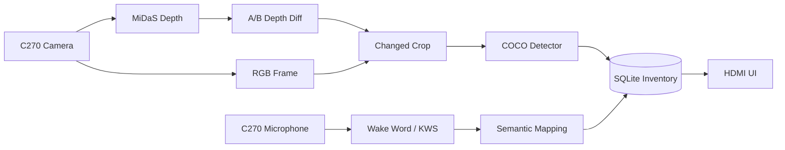

# SmartDrawer

SmartDrawer 是以 **FRDM-i.MX93**、Logitech C270 與 Edge AI 建構的智慧抽屜原型。系統透過兩次穩定的相對深度快照找出物品變更區域，只對該區域執行物件辨識，並在抽屜關閉後更新本機 SQLite 庫存。

> 本專案採 Edge-only 架構；正常執行不依賴 PC、Cloud API 或網路服務。

## 專案狀態

| 項目 | 狀態 |
|---|---|
| PC deterministic simulation | ✅ 可執行 |
| MiDaS v2.1 Small / Ethos-U | ✅ 已於 i.MX93 驗證 |
| GoPoint SSDLite / Ethos-U | ✅ 已於 i.MX93 驗證 |
| SQLite inventory transaction | ✅ 已實作 |
| 英文 ASR 與 semantic mapping probe | ✅ 已實作 |
| 中文「Hey 抽屜」KWS | 🚧 等待自訂 NXP VIT 模型 |
| 完整 MVP 硬體驗收 | 🚧 進行中 |

詳細硬體契約、狀態機與驗收標準請參考 [`docs/DESIGN.md`](docs/DESIGN.md)。

## 核心流程

```text
抽屜開啟
  → 深度畫面穩定，建立 Snapshot A 並判斷層級
  → 使用者放入或取出一件物品
  → 深度再次穩定，建立 Snapshot B
  → A/B depth diff 產生唯一 changed crop
  → signed depth 判斷 put / take
  → 只對 RGB_A 或 RGB_B 的 changed crop 執行一次 detector
  → 抽屜關閉後，以 SQLite transaction 更新庫存
```

主要設計原則：

- 不掃描或重新盤點整層抽屜。
- MiDaS 僅提供相對深度，不轉換為實際公分。
- 每次 transaction 僅接受一件物品與一個有效變更區域。
- `unknown`、多物件、層級不明或模型錯誤均不得修改庫存。
- RGB、depth 與 audio 僅存在記憶體，不上傳、不永久保存。

## 系統架構



## 硬體與 Runtime

### 目標硬體

- NXP FRDM-i.MX93
- Logitech C270 camera / microphone
- HDMI display 與 USB mouse
- 固定俯角安裝的 1–6 層抽屜
- 選配：VL53L0X layer-ranging prototype

### Board runtime

- NXP Linux BSP
- Python 3
- GStreamer / NNStreamer / GTK 3
- OpenCV、NumPy
- `tflite-runtime` 或 `ai-edge-litert`
- `/usr/lib/libethosu_delegate.so`
- Voice probe 額外需要 `ffmpeg`、`onnxruntime`、`tokenizers`

硬體套件應優先使用 NXP BSP 提供的版本，避免自行安裝的 wheel 與 Ethos-U runtime 不相容。

## 快速開始

### 執行核心檢查

核心測試只使用 Python standard library：

```bash
python tests/test_core.py
```

預期輸出：

```text
check_core: all checks passed
```

### 執行 PC simulation

```bash
python -m smart_drawer.app --simulate
```

Simulation 會驗證初始化、put/take、SQLite transaction、semantic lookup 與 voice lockout，不會假裝存在相機、NPU 或硬體 fallback。

## i.MX93 執行方式

先確認 camera、display 與 Ethos-U delegate：

```bash
ls -l /dev/video* /dev/ethosu0 /usr/lib/libethosu_delegate.so
v4l2-ctl --list-devices
arecord -l
```

### MiDaS HDMI preview

```bash
python3 -m smart_drawer.midas_hdmi_demo --self-test
python3 -m smart_drawer.midas_hdmi_demo \
  --camera /dev/video2 \
  --model models/midas_v2_1_small_quant_vela.tflite
```

### NNStreamer preview

```bash
XDG_RUNTIME_DIR=/run/user/0 WAYLAND_DISPLAY=wayland-0 \
python3 -m smart_drawer.midas_nnstreamer \
  --camera /dev/video2 \
  --model models/midas_v2_1_small_quant_vela.tflite
```

完整 detector、A/B inventory probe 與參數：

```bash
python3 -m smart_drawer.yolo_ab_inventory_probe --help
```

沒有 voice runtime 時可加上 `--no-voice`；沒有 VL53L0X 時可加上 `--no-vl53`。

## 模型

| 用途 | Artifact | 狀態 |
|---|---|---|
| Relative depth | `models/midas_v2_1_small_quant_vela.tflite` | i.MX93 Vela validated |
| Object detection | `models/ssdlite_mobilenet_v2_coco_quant_uint8_float32_no_postprocess_vela.tflite` | Selected runtime detector |
| YOLO reference | `models/yolov8n_coco_int8.tflite` | Reference only |
| English ASR | `models/moonshine_tiny_5s_i8.tflite` | CPU probe |
| Semantic mapping | MiniLM ONNX + precomputed vectors | CPU probe |
| Mandarin KWS | NXP VIT custom artifact | 尚未取得 |

模型來源、checksum 與限制記錄於：

- [`models/README.md`](models/README.md)
- [`config/model_manifest.json`](config/model_manifest.json)

## 設定

| 路徑 | 用途 |
|---|---|
| `config/model_manifest.json` | Model contract、checksum、backend 與 thresholds |
| `config/enabled_classes.json` | Demo 啟用的 20 個 COCO 類別 |
| `config/kws_vocabulary.json` | 固定語音詞彙與別名 |
| `config/semantic_catalog.json` | Simulation semantic fixture |
| `config/semantic_catalog_en.json` | English semantic catalog |
| `config/semantic_catalog_en_minilm_q8.npz` | 預先計算的 semantic vectors |

實機 thresholds 必須透過 calibration 決定，不應直接把預設值視為所有安裝環境的保證值。

## Repository structure

```text
.
├── smart_drawer/          # Python package、runtime、detectors 與 probes
│   └── vendor/            # Vendored VL53L0X / CircuitPython drivers
├── config/                # Runtime manifests 與 catalogs
├── models/                # Model artifacts、labels、priors、tokenizers
├── assets/audio/          # 手動 ASR 測試音訊
├── docs/                  # DesignDoc 與 Hackathon 文件
├── tests/                 # Dependency-free acceptance checks
└── README.md
```

## 已知限制

- 中文 wake word 與 20-class Mandarin KWS artifact 尚未完成，是完整 MVP 的 blocker。
- MiDaS 是單眼相對深度，無法提供可靠的公分距離。
- MVP 不支援同時開啟多層、一次操作多件物品、透明物品或嚴重遮擋。
- Camera、櫃體位置或光線改變後需要重新校正。
- 任意抽屜開度造成的 depth baseline 漂移目前不補償。
- 完整 FPS、RSS 與 30 分鐘 soak test 仍需於最終硬體配置驗收。

## 文件

- [完整系統設計與驗收標準](docs/DESIGN.md)
- [NXP Hackathon 文件](docs/NXP%20-%20Hackathon.pdf)
- [模型與來源說明](models/README.md)
